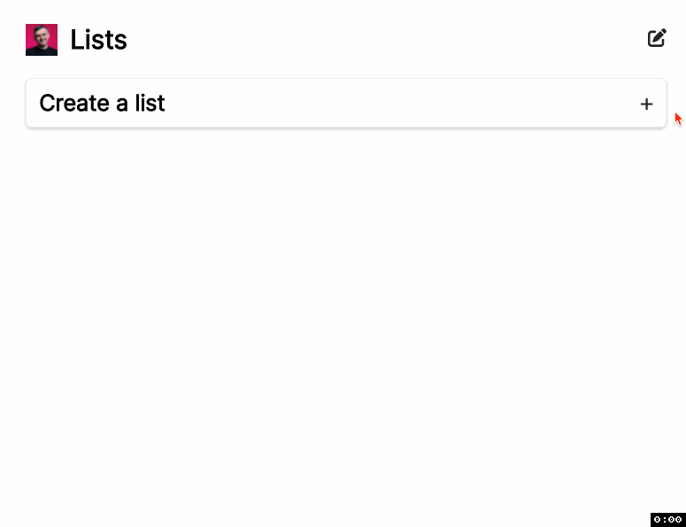

# To-Do List
## Pixel perfect SPA built with React, based off of a provided figma design.  

## To get started:

* ### fork and clone the repo
* ###  `npm i` to download all dependnecies
* ### `npm start` to build
* ### Open [http://localhost:3000]to view it in your browser to build

## Figma Designs:

## DEMO:

