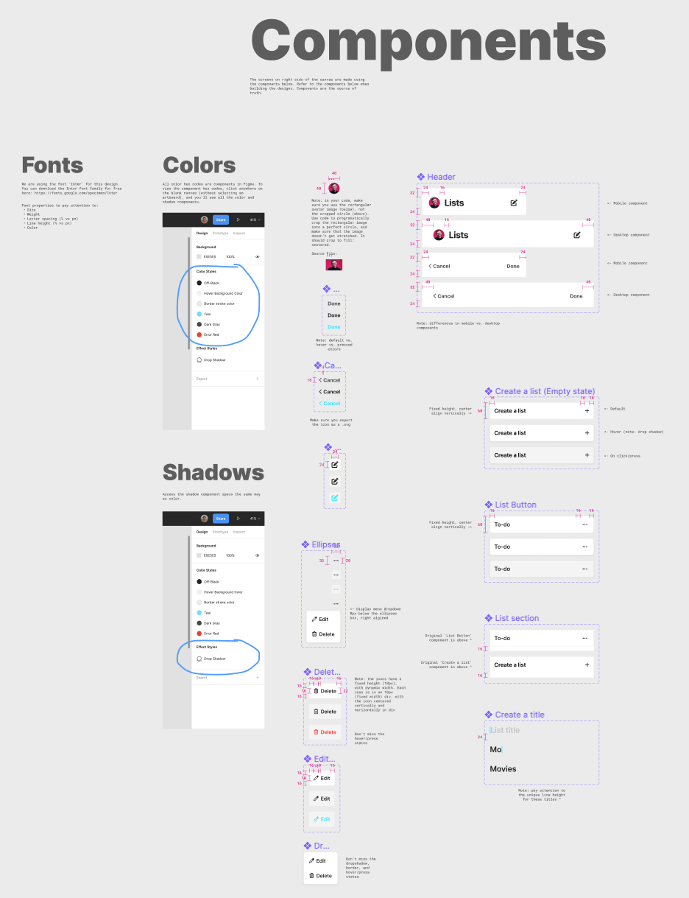
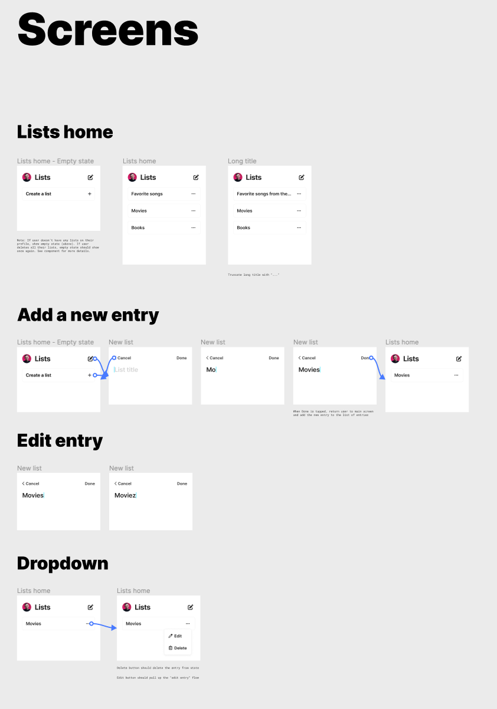

## Basic React To-Do List

### To get started:

* ### fork and clone the repo
* ###  `npm i` to download all dependnecies
* ### `npm start` to build
* ### Open [http://localhost:3000]to view it in your browser to build

### Figma Designs:

